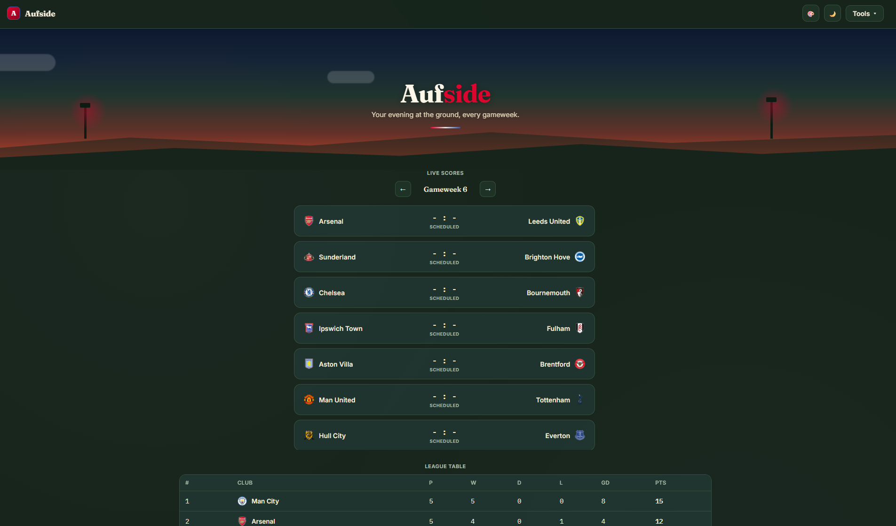

# Aufside — FPL Companion

A lightweight, installable companion app for Fantasy Premier League. Check your squad, get transfer ideas, track fixtures and injuries, and follow live Premier League scores — all in one place, with no login required beyond your public FPL team ID.

**Live app:** https://aufside-lpls.vercel.app

## Features

| Tool | What it does |
|---|---|
| **My Team** | Your squad, prices & projected points — view as a pitch formation or a plain list |
| **Transfer Recommendations** | Suggests swaps using a transparent, weighted scoring formula — not a black box |
| **Injury Tracker** | Doubts, injuries & suspensions across the league |
| **Transfer News** | Real-world club transfer headlines |
| **Player Explorer** | Search, filter, and compare any player |
| **Fixture Difficulty** | Next 5 gameweeks, colour-coded by difficulty |
| **Fixtures Calendar** | Every Premier League match this season, browsable month by month |
| **Live Scores & Table** | Live match scores plus the full league table with a last-5 form guide |
| **Mini-League** | Standings for your private FPL mini-league |
| **Deadline Reminders** | Countdown to the next gameweek deadline |

Also installable as a **Progressive Web App** — add it to your home screen on iOS/Android or install it as a desktop app, and it keeps working offline for pages you've already visited.

## How transfer recommendations work

There's no AI or ML model behind this — it's a small, fully explainable scoring formula. Every player is scored out of 10 across five factors:

- **Form** — recent points
- **Value** — points earned per £million spent
- **Fixture ease** — how favourable their next few opponents are
- **Minutes reliability** — how consistently they start/play
- **Underlying stats** — expected goals/assists-style data from the FPL API

The weighted total decides who's "in form" versus who's a weak link in your squad. The Transfer Recommendations page compares your worst-scoring players against the best available replacements in the same position, respecting your budget and the 3-players-per-club rule, and only suggests a swap when the upgrade is meaningful.

## Tech stack

Deliberately minimal — no framework, no build step:

- **Frontend:** vanilla JavaScript (ES modules), plain HTML, plain CSS with custom properties for theming
- **State:** a single shared state object (`js/state.js`) — no Redux/Context, just plain reads/writes
- **Backend:** three small Python serverless functions (`api/`), running on Vercel's Python runtime
- **Hosting:** [Vercel](https://vercel.com) — static frontend + serverless functions, deployed straight from this repo
- **PWA:** `manifest.json` + a service worker (`sw.js`) for installability and offline support

### Data sources

- [FPL's official API](https://fantasy.premierleague.com/api/bootstrap-static/) — squads, prices, form, fixtures, deadlines (proxied through `api/proxy.py` to work around CORS)
- [football-data.org](https://www.football-data.org/) — live scores, league standings, and club squad rosters
- [BBC Sport](https://www.bbc.co.uk/sport/football) RSS feed — Premier League news headlines

## Project structure

```
aufside/
├── index.html            # single HTML shell — everything else is JS-rendered
├── manifest.json         # PWA config
├── sw.js                 # service worker (offline caching)
├── css/
│   └── style.css         # all styling, theme variables live here
├── icons/                # app icons for install/home screen
├── api/                  # Python serverless functions
│   ├── proxy.py          # CORS proxy for FPL's own API
│   ├── livescores.py     # scores & standings via football-data.org
│   └── team.py           # club squad info via football-data.org
└── js/
    ├── app.js            # entry point — boots the app, owns the router
    ├── router.js         # reads the URL hash
    ├── state.js           # shared app state
    ├── api.js              # all fetch calls + caching
    ├── constants.js         # Tools menu, position labels, etc.
    ├── scoring.js             # scoring formula, crest/kit URL helpers
    ├── tool-shell.js            # shared page wrapper (title/description/body)
    ├── nav.js, theme.js, accent.js, install.js   # small standalone features
    └── views/                                      # one file per page
        ├── landing.js, my-team.js, team.js, players.js,
        ├── transfers.js, fixtures.js, calendar.js, live.js,
        └── injuries.js, deadlines.js, mini-league.js, transfer-news.js
```

## Running it locally

No build step needed — the [Vercel CLI](https://vercel.com/docs/cli) serves the static files and runs the Python functions locally in one command.

```bash
git clone https://github.com/Amey-tmb/aufside.git
cd aufside
vercel dev
```

### Environment variables

Only one is required, and only for two features:

```
FOOTBALL_DATA_API_KEY=d9713f3fb6a04232922ed8370a2fc7e8
```

Get a free key at [football-data.org](https://www.football-data.org/client/register). It's used by **Live Scores & Table** and the **club Team pages**. Everything else (My Team, Transfer Recommendations, Player Explorer, Fixtures, etc.) works without it, since those pull directly from FPL's public API.

> **Note:** football-data.org's free tier has a fairly low per-minute rate limit shared across all visitors. If you see a "rate-limited" message, it usually clears up within a minute — the app retries automatically and caches responses to minimise how often this happens.

## Screenshots

<!-- Add screenshots here, e.g.: -->
<!--  -->
<!--  -->

## Roadmap / ideas

- Points-per-million player rankings
- Optimal starting XI suggester (given your existing squad/budget)
- Self-tracked price-change watcher
- Chip usage tracker (Wildcard, Bench Boost, Free Hit, Triple Captain)
- Downloadable/shareable squad image export

## License

<!-- Add a license here if you'd like this to be open source, e.g. MIT: -->
<!-- This project is licensed under the MIT License — see LICENSE for details. -->

## Why I built this

<!-- A sentence or two on your motivation — makes for a nice personal touch in a portfolio README. -->
